

    

<h1 align="center">Speech Translate</h1>

    
    
     
    
    
     
    
    

Speech Translate is a practical application that combines OpenAI's Whisper ASR model with free translation APIs. It serves as a versatile tool for both real-time / live speech-to-text and speech translation, allowing the user to seamlessly convert spoken language into written text. Additionally, it has the option to import and transcribe audio / video files effortlessly.

Speech Translate aims to expand whisper ability by combining it with some translation APIs while also providing a simple and easy to use interface to create a more practical application. This application is also open source, so you can contribute to this project if you want to.

  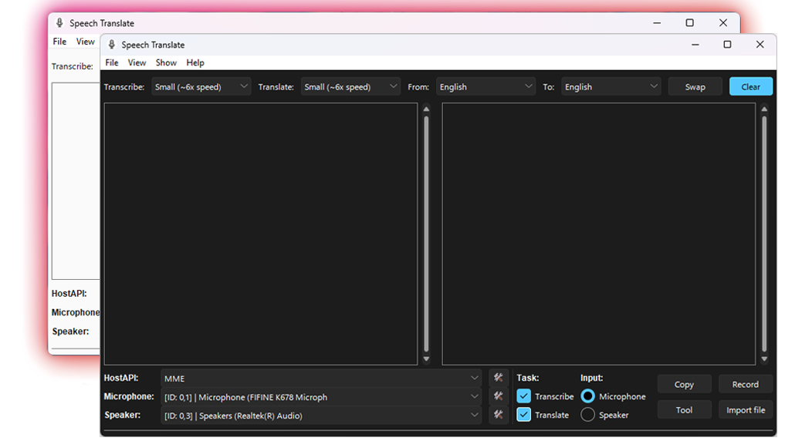

  
Preview - Usage

  

    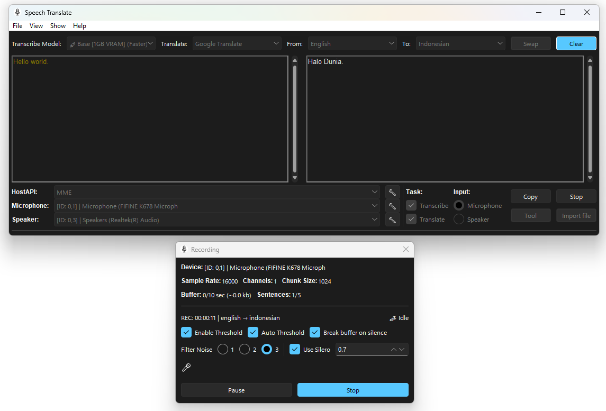
    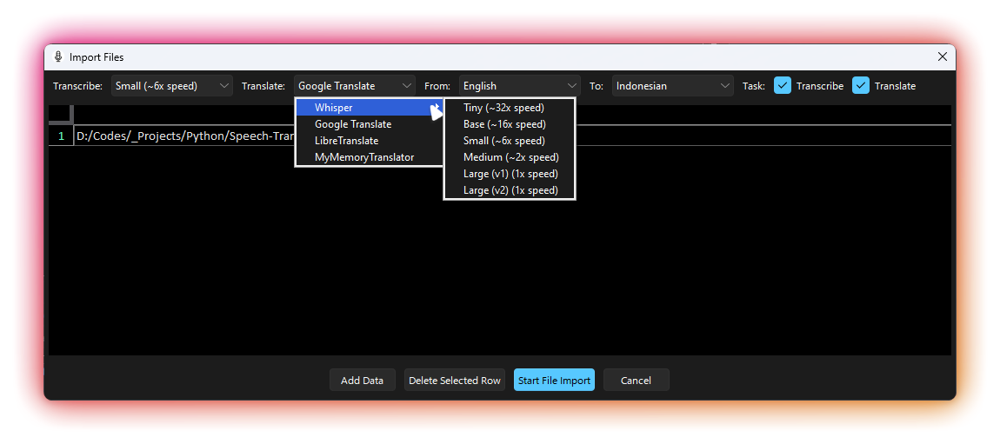
    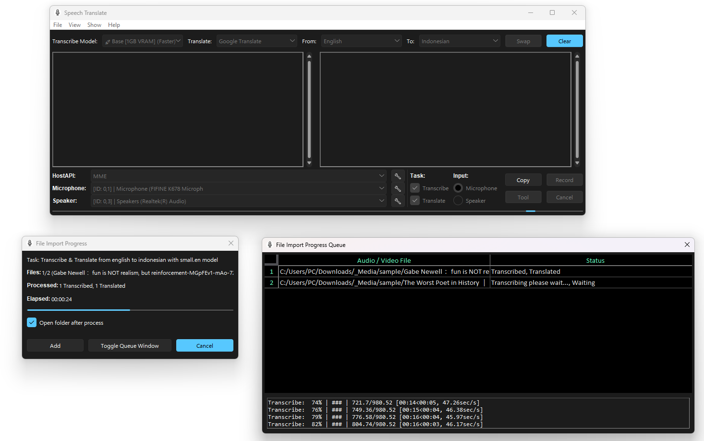
    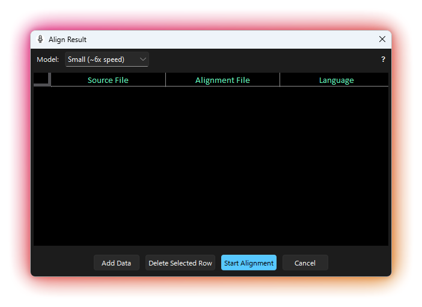
    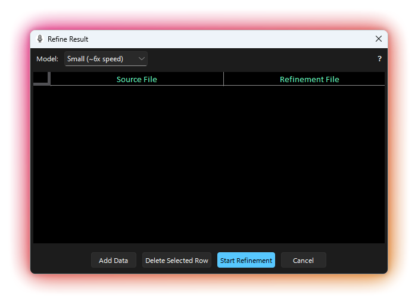
    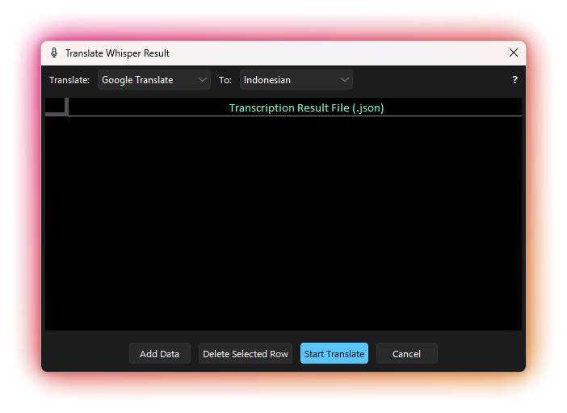
    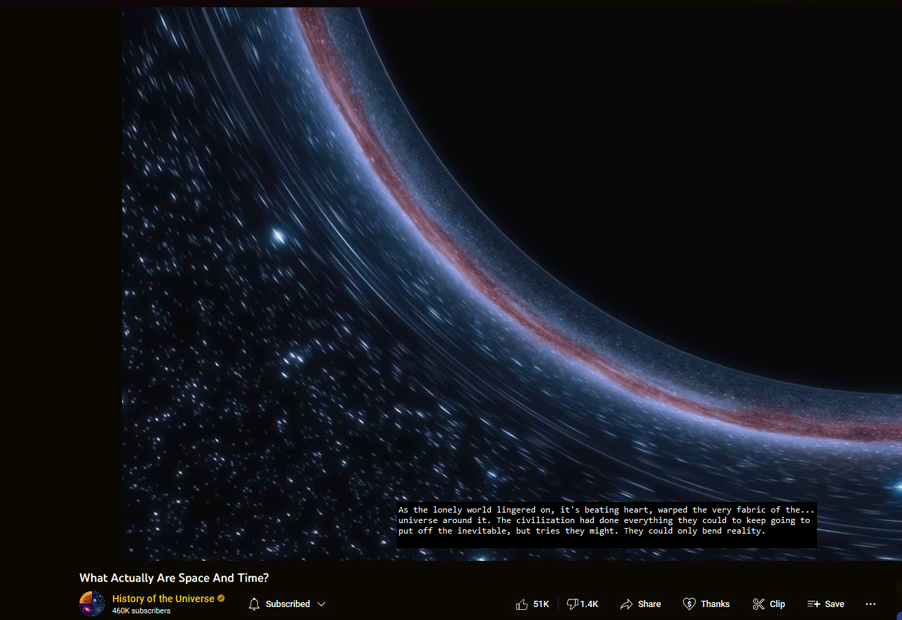 
    Transcribe mode on detached window (English)    
    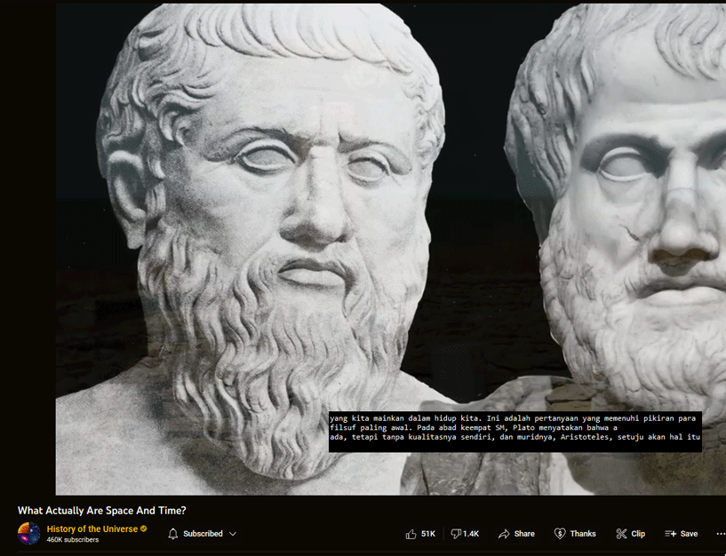 
    Translate mode on detached window (English to Indonesia)
  

  
Preview - Setting

  

    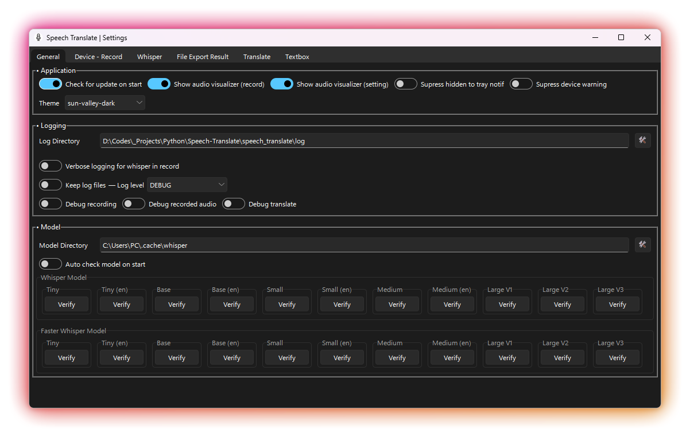
    
    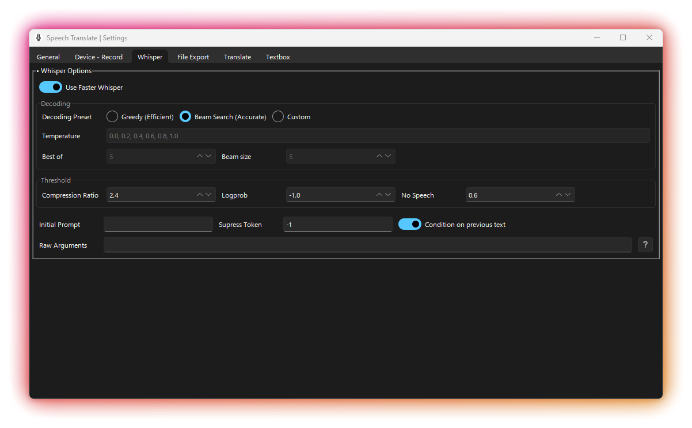
    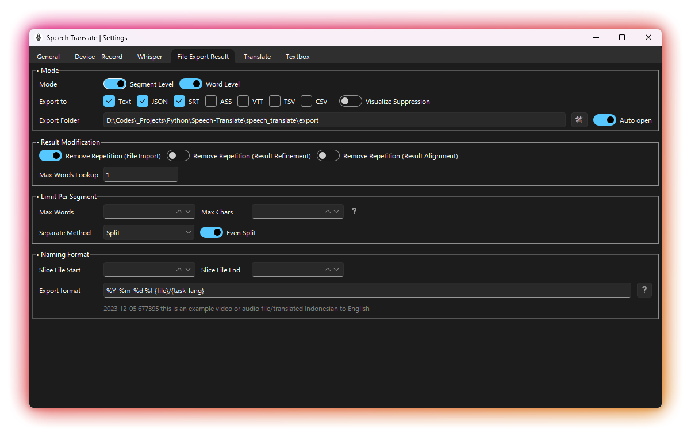
    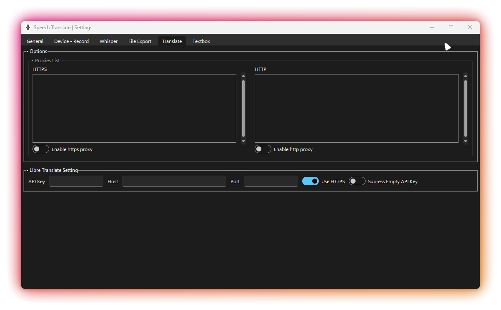
    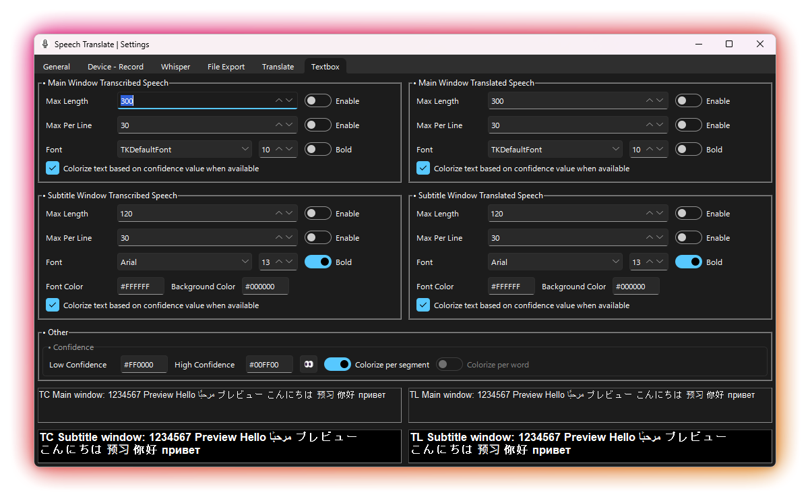
  

 

<h1>Table Of Contents</h1>

- [🚀 Features](#-features)
- [📜 Requirements](#-requirements)
- [🔧 Installation](#-installation)
  - [From Prebuilt Binary (.exe)](#from-prebuilt-binary-exe)
  - [As A Module](#as-a-module)
  - [From Git](#from-git)
- [📚 More Information](#-more-information)
- [🛠️ Building / Developing / Compiling Yourself](#️-building--developing--compiling-yourself)
  - [Setup](#setup)
  - [Running the app](#running-the-app)
  - [Building](#building)
  - [Compatibility](#compatibility)
- [💡 Contributing](#-contributing)
- [License](#license)
- [Attribution](#attribution)
- [Other](#other)

# 🚀 Features

- Speech to text and/or Speech translation (transcribed text can be translated to other languages) with live input from mic or speaker 🎙️
- Customizable [subtitle window](https://github.com/Dadangdut33/Speech-Translate/raw/master/preview/13.png) for live speech to text and/or speech translation
- Batch file processing of audio / video files for transcription and translation with output of (.txt .srt .ass .tsv .vtt .json) 📂
- Result [refinement](https://github.com/jianfch/stable-ts#refinement)
- Result [alignment](https://github.com/jianfch/stable-ts#alignment)
- Result translation (Translate only the result.json)

# 📜 Requirements

- Compatible OS Installation:

|   OS    | Installation from Prebuilt binary | Installation as a Module | Installation from Git |
| :-----: | :-------------------------------: | :----------------------: | :-------------------: |
| Windows |                ✔️                 |            ✔️            |          ✔️           |
|  MacOS  |                ❌                 |            ✔️            |          ✔️           |
|  Linux  |                ❌                 |            ✔️            |          ✔️           |

\* Python 3.8 or later (3.11 is recommended) for installation as module.

- **Speaker input** only work on _windows 8 and above_ (Alternatively, you can make a loopback to capture your system audio as virtual input (like mic input) by using this guide/tool: [[Voicemeeter on Windows]](https://voicemeeter.com/)/[[YT Tutorial]](https://youtu.be/m6rp9lkiFBU) - [[pavucontrol on Ubuntu with PulseAudio]](https://wiki.ubuntu.com/record_system_sound) - [[blackhole on MacOS]](https://github.com/ExistentialAudio/BlackHole))
- Internet connection is needed **only for translation with API & downloading models** (If you want to go fully offline, you can setup [LibreTranslate](https://github.com/LibreTranslate/LibreTranslate) on your local machine and set it up in the [app settings](https://github.com/Dadangdut33/Speech-Translate/wiki/Options#libre-translate-setting))
- **Recommended** to have `Segoe UI` font installed on your system for best UI experience (For OS other than windows, you can see this: [Ubuntu](https://github.com/mrbvrz/segoe-ui-linux) - [MacOS](https://github.com/tejasraman/segoe-ui-macos))
- **Recommended** to have capable [GPU with CUDA compatibility](https://developer.nvidia.com/cuda-gpus) (prebuilt version is using CUDA 11.8) for faster result. Each whisper model has different requirements, for more information you can check it directly at the [whisper repository](https://github.com/openai/whisper).

|  Size  | Parameters | Required VRAM | Relative speed |
| :----: | :--------: | :-----------: | :------------: |
|  tiny  |    39 M    |     ~1 GB     |      ~32x      |
|  base  |    74 M    |     ~1 GB     |      ~16x      |
| small  |   244 M    |     ~2 GB     |      ~6x       |
| medium |   769 M    |     ~5 GB     |      ~2x       |
| large  |   1550 M   |    ~10 GB     |       1x       |

\* This information is also available in the app (hover over the model selection in the app and there will be a tooltip about the model info). Also note that when using faster-whisper, the model speed will be significantly faster and have smaller vram usage, for more information about this please visit [faster-whisper repository](https://github.com/guillaumekln/faster-whisper)

# 🔧 Installation

> [!IMPORTANT]  
> Please take a look at the [Requirements](#requirements) first before installing. For more information about the usage of the app, please check the [wiki](https://github.com/Dadangdut33/Speech-Translate/wiki)

## From Prebuilt Binary (.exe)

> [!NOTE]  
> The prebuilt binary is shipped with CUDA 11.8, so it will only work with GPU that has CUDA 11.8 compatibility. If your GPU is not compatible, you can try [installation as module](#as-a-module) or [from git](#From-Git) below.

1. Download the [latest release](https://github.com/Dadangdut33/Speech-Translate/releases/latest) (There are 2 versions, CPU and GPU/CUDA)
2. Install/extract the downloaded file
3. Run the program
4. Set the settings to your liking
5. Enjoy!

## As A Module

> [!NOTE]  
> Use python 3.11 for best compatibility and performance

> [!WARNING]  
> You might need to have [Build tools for Visual Studio](https://visualstudio.microsoft.com/visual-cpp-build-tools/) (or the equivalent of it on your OS) installed

To install as module, we can use pip, with the following command.

- Install with **GPU (Cuda compatible)** support:

  `pip install -U git+https://github.com/Dadangdut33/Speech-Translate.git --extra-index-url https://download.pytorch.org/whl/cu118`

  cu118 here means CUDA 11.8, you can change it to other version if you need to. You can check older version of pytorch [here](https://pytorch.org/get-started/previous-versions/) or [here](https://download.pytorch.org/whl/torch_stable.html).

- **CPU** only:

  `pip install -U git+https://github.com/Dadangdut33/Speech-Translate.git`

You can then run the program by typing `speech-translate` in your terminal/console. Alternatively, when installing as a module, you can also clone the repo and install it locally by running `pip install -e .` in the project directory. (Don't forget to add `--extra-index-url` if you want to install with GPU support)

**Notes For Installation as Module:**

- If you are **updating from an older version**, you need to add `--upgrade --force-reinstall` at the end of the command, if the update does not need new dependencies you can add `--no-deps` at the end of the command to speed up the installation process.
- If you want to **install** from a **specific branch or commit**, you can do it by adding `@branch_name` or `@commit_hash` at the end of the url. Example: `pip install -U git+https://github.com/Dadangdut33/Speech-Translate.git@dev --extra-index-url https://download.pytorch.org/whl/cu118`
- The **--extra-index-url here is for the version of CUDA**. If your device is not compatible or you need to use other version of CUDA you can check older version of pytorch [here](https://pytorch.org/get-started/previous-versions/) or [here](https://download.pytorch.org/whl/torch_stable.html).

## From Git

If you prefer cloning the app directly from git/github, you can follow the guide in [development (wiki)](https://github.com/Dadangdut33/Speech-Translate/wiki/Development) or [below](#setup). Doing it this way might also provide a more stable environment.

# 📚 More Information

Check out the [wiki](https://github.com/Dadangdut33/Speech-Translate/wiki) for more information about the app, user settings, how to use it, and more.

# 🛠️ Building / Developing / Compiling Yourself

> [!NOTE]  
> Check the [wiki](https://github.com/Dadangdut33/Speech-Translate/wiki) for more details

## Setup

> [!NOTE]  
> It is recommended to create a virtual environment, but it is not required. I also use python 3.11.6 for development, but it should work with python 3.8 or later

> [!WARNING]  
> You might need to have [Build tools for Visual Studio](https://visualstudio.microsoft.com/visual-cpp-build-tools/) installed

1. Clone the repo with its submodules by running `git clone --recurse-submodules https://github.com/Dadangdut33/Speech-Translate.git`
2. `cd` into the project directory
3. Create a [virtual environment](https://docs.python.org/3/library/venv) by running `python -m venv venv`
4. [Activate your virtual environment](https://docs.python.org/3/library/venv.html#how-venvs-work)
5. Install all the dependencies needed by running `pip install -r requirements.txt --extra-index-url https://download.pytorch.org/whl/cu118` if you are using GPU or `pip install -r requirements.txt` if you are using CPU.
6. Run `python Run.py` in root directory to run the app.

Notes:

- If you forgot the `--recure-submodules` flag when cloning the repository and the submodules is not cloned correctly, you can do `git submodule update --init --recursive` in the project directory to pull the needed submodules.
- The `--extra-index-url` is needed to install CUDA version of pytorch and for this one we are using CUDA 11.8. If your device is not compatible or you need to use other version of CUDA you can check the previous pytorch version in this [link](https://pytorch.org/get-started/previous-versions/) or [this](https://download.pytorch.org/whl/torch_stable.html).

## Running the app

You can run the app by running the [`Run.py`](./Run.py) located in **root directory**. Alternatively you can also run it using `python -m speech_translate` in the **root directory**.

## Building

**Before compiling the project**, make sure you have installed all the dependencies and setup your pytorch correctly. Your pytorch version will control wether the app will use GPU or CPU (that's why it's recommended to make virtual environment for the project).

The pre compiled version in this project is built using cx_freeze, we have provided the script in [build.py](./build.py). This build script is only configured for windows build at the moment, but feel free to contribute if you know how to build properly for other OS.

To compile it into an exe run `python build.py build_exe` in the **root directory**. This will produce a folder containing the compiled project alongside an executable in the `build` directory. After that, use innosetup script to create an installer. You can use the provided [installer.iss](./installer.iss) to create the installer.

## Compatibility

This project should be compatible with Windows (preferrably windows 10 or later) and other platforms. But I haven't tested it extensively on other platforms. If you find any bugs or issues, feel free to create an issue.

# 💡 Contributing

Feel free to contribute to this project by forking the repository, making your changes, and submitting a pull request. You can also contribute by creating an issue if you find a bug or have a feature request. Also, feel free to give this project a star if you like it.

# License

This project is licensed under the MIT License - see the [LICENSE](LICENSE) file for details

# Attribution

- [Sunvalley TTK Theme](https://github.com/rdbende/Sun-Valley-ttk-theme/) (used for app theme although i modified it a bit)
- [Noto Emoji](https://fonts.google.com/noto/specimen/Noto+Emoji) for the icons used in the app

# Other

Check out my other similar project called [Screen Translate](https://github.com/Dadangdut33/Screen-Translate/) a screen translator / OCR tools made possible using tesseract.
